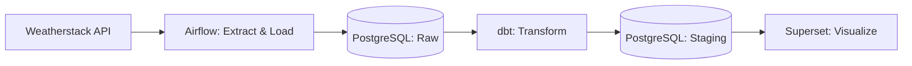

# weatherstack-data-pipeline

## Introduction
An automated and containerized ELT Pipeline from data ingestion, transformation to visualization using Weatherstack API

## Architecture

## Tech Stack

| Layer            | Tool                  | Why |
|-------------------|-----------------------|-----|
| Orchestration      | Apache Airflow 3.2.2   | Schedules and monitors the hourly extract-and-load job, with retry and failure visibility out of the box. |
| Data Warehouse     | PostgreSQL             | Stores both raw API payloads and transformed staging tables in a single, queryable relational store. |
| Transformation     | dbt                     | Version-controlled, testable SQL transformations — turns raw JSON responses into clean, structured tables. |
| Visualization      | Apache Superset         | Open-source BI tool for building interactive dashboards directly on top of the warehouse. |
| Containerization   | Docker / Docker Compose | Runs the entire multi-service stack (Airflow, Postgres, dbt, Superset, Redis) reproducibly in any environment, including GitHub Codespaces. |
| Language           | Python                  | Handles API extraction and database insertion logic. |

## Setup / How to Run

### 1. Clone the repo
```bash
git clone https://github.com/<your-username>/weatherstack-data-pipeline.git
cd weatherstack-data-pipeline
```

### 2. Set up credentials
This project keeps all credentials out of git. If you're running in **GitHub Codespaces**, add the following as repository secrets under **Settings → Secrets and variables → Codespaces**:

| Secret name | Description |
|---|---|
| `WEATHER_API_KEY` | Your Weatherstack API key |
| `DBT_PROFILES_YML` | Full contents of `dbt/profiles.yml` (see below for template) |
| *(others from `docker/.env`)* | Superset admin credentials, secret key, Redis config |

If running locally instead, create a `.env` file in the project root and a `docker/.env` file, using `.env.example` as a reference (see note below).

`dbt/profiles.yml` template:
```yaml
my_project:
  target: dev
  outputs:
    dev:
      type: postgres
      host: db
      port: 5432
      user: <your_db_user>
      password: <your_db_password>
      dbname: <your_db_name>
      schema: dev
      threads: 4
```

### 3. Start the stack
```bash
docker compose up
```
This starts Postgres, Airflow, dbt, Redis, and Superset. First boot takes a minute or two — Postgres runs its init scripts, Airflow runs `airflow db migrate`, and Superset runs its own DB migration and admin setup.

### 4. Trigger the pipeline
1. Open the Airflow UI at `localhost:8000`.
2. Find the `weatherstack-api-orchestrator` DAG and toggle it **on** (unpaused).
3. Click **Trigger** → **Single Run** to fetch data immediately (or wait for the hourly schedule).
4. Check the `ingest_data_task` log — confirm it logs `Data successfully inserted!`.

### 5. Run dbt transformations
Once at least one successful DAG run has landed data in `dev.raw_weather_data`:
```bash
docker compose run --rm dbt debug   # verify the connection
docker compose run --rm dbt run     # build staging models
```

### 6. View the dashboard
Open Superset at `localhost:8088`, connect a database pointing at `db:5432` / `dev` schema, and build or view charts against `stg_weather_data`.

## Key Features / Design Decisions

- **ELT, not ETL** — raw API responses are loaded into PostgreSQL as-is first (`dev.raw_weather_data`), and transformation happens afterward inside the database via dbt. This keeps raw data available for reprocessing if transformation logic changes later, and pushes compute to the database rather than the extraction script.
- **Batch, not streaming** — the pipeline runs on a fixed hourly schedule via Airflow, not a continuous event stream. This fits the source (a polled weather API, not an event-driven feed) and keeps the architecture simple and easy to reason about.
- **Fully containerized** — every service (Airflow, PostgreSQL, dbt, Redis, Superset) runs in Docker Compose, so the whole stack is reproducible from a clean environment (tested in GitHub Codespaces) without manual setup steps.
- **Secrets kept out of version control** — API keys, database credentials, and dbt connection profiles are excluded via `.gitignore` and restored via GitHub Codespaces Secrets rather than committed to the repo.

## Known Limitations / Future Improvements

- **No idempotency on inserts** — re-running the same DAG interval currently inserts duplicate rows rather than upserting. A future version would add a unique constraint and `ON CONFLICT ... DO UPDATE` logic on the raw table.
- **No alerting on pipeline failure** — failed DAG runs are currently only visible by checking the Airflow UI manually. Adding a notification (e.g. Slack/email on task failure) would make failures actionable without manual monitoring.
- **No automated data quality tests** — dbt supports built-in tests (not null, unique, accepted values) which aren't yet configured on the staging models.
- **Single data source** — currently limited to one city due to the Weatherstack free-tier plan; the extraction logic would need generalizing to support multiple locations or an alternate API (e.g. Open-Meteo).
